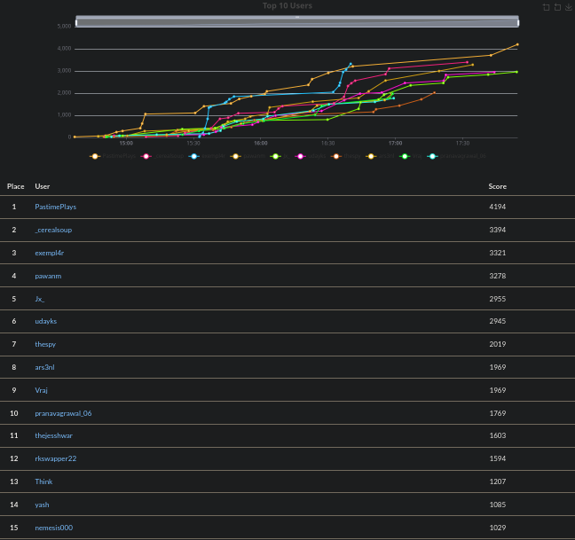
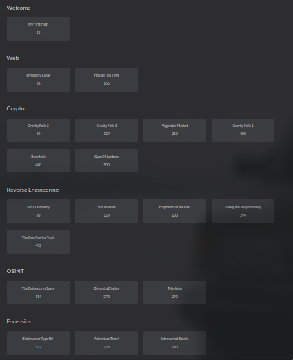
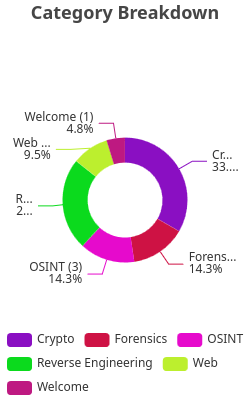
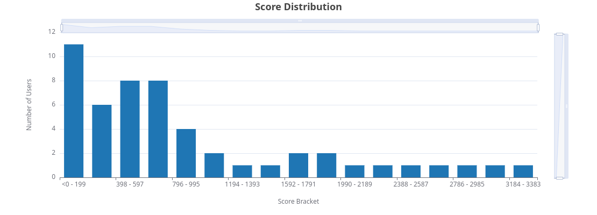

# KOSS CTF 2025

This repository contains official **source code** and **writeups** for challenges from **KOSS CTF 2025**

Link to the Presentation: [KOSS Cybersecurity Workshop 2025](https://www.canva.com/design/DAGdHz6JQJg/Q_JS19H7V52mk6kTZXqhhQ/view?utm_content=DAGdHz6JQJg&utm_campaign=designshare&utm_medium=link2&utm_source=uniquelinks&utlId=h5037fc3e63)

### Scoreboard (top 15)

### Statistics

| Metric                                  | Value |
| --------------------------------------- | ----- |
| Total Registered Players                | 60    |
| Players that solve at least one challenge | 52 |
| Total Number of Challenges              | 20    |

#### Challenges

| Serial Number | Challenge Name | Category | Author |
|--------------|---------------|----------|--------|
| 1 | [Brainfuck](./cry/brainfuck/README.md) | cry | subzcuber (with inspiration from x3 CTF) |
| 2 | [Gravity Falls 1](./cry/gravity-falls-1/README.md) | cry | Alex Hirsch[^1] | 
| 3 | [Gravity Falls 2](./cry/gravity-falls-2/README.md) | cry | Alex Hirsch[^1] |
| 4 | [Gravity Falls 3](./cry/gravity-falls-3/README.md) | cry | Alex Hirsch[^1] |
| 5 | [QueeR Numbers](./cry/queer-numbers/README.md) | cry | subzcuber |
| 6 | [Vegetable Market](./cry/vegetable-market/README.md) | cry | subzcuber |
| 7 | [Adventure Time](./for/adventure-time/README.md) | for | subzcuber |
| 8 | [Bladerunner Type Shi-](./for/bladerunner-type-shi/README.md) | for | subzcuber |
| 9 | [Introverted Bocchi](./for/introverted-bochi/README.md) | for | subzcuber |
| 10 | [Beyond a Display](./osint/beyond_a_plane/README.md) | osint | xenon[^2] |
| 11 | [Television](./osint/television/README.md) | osint | moonlight[^3] |
| 12 | [The Eminence in Space](./osint/the-eminence-in-space/README.md) | osint | subzcuber |
| 13 | [Leo's Discovery](./rev/Leo's%20Discovery/README.md) | rev | Prem Agarwal |
| 14 | [Fragments of the Past](./rev/Fragments%20of%20the%20Past/README.md) | rev | Prem Agarwal |
| 15 | [The Overflowing Truth](./rev/The%20Overflowing%20Truth/README.md) | rev | Prem Agarwal |
| 16 | [Size Matters](./rev/Size%20Matters/README.md) | rev | Prem Agarwal |
| 17 | [Taking The Responsibility](./rev/Taking%20The%20Responsibility/README.md) | rev | Prem Agarwal |
| 18 | [Hokago Tea Time](./web/hokagou-tea-time/README.md) | web | subzcuber |
| 19 | [Invisibilty Cloak](./web/invisible/README.md) | web | subzcuber |

[^1]: Alex Hirsch is the creator of Gravity Falls. He hid many (many) cryptograms in Gravity Falls, conducted a global treasure hunt after the show ended, and much more.
[^2]: `xenon` is a member of team Cryptonite from Manipal Institute of Technology. We included this fantastic challenge created by them for niteCTF 2024 in this CTF. All credit goes to them though of course. Thank you!
[^3]: `moonlight` is a member of team Cyb0rg from University of South California. We included this challenge they made for USC CTF Fall 2024 in our CTF. All credit goes to them of course. Thanks!

#### Category Breakdown of Challenges

#### Score Distribution

