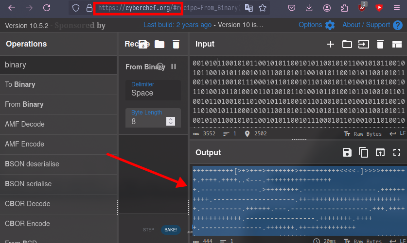
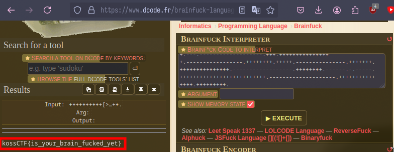

# Brainfuck

Flag: `kossCTF{is_your_brain_fucked_yet}`

Author: `subzcuber`

Description: 
> Help!!! This message is fucking with my brain

---

I saw a very similar challenge recently in [x3 CTF](https://x3c.tf/) which inspired this challenge (they're the same challenge)

Just convert the binary to text, you'll get something that looks like [Brainfuck](https://en.wikipedia.org/wiki/Brainfuck). Just put that into a brainfuck compiler. I used [Dcode](https://decode.fr/en) to encode this.

```
++++++++++[>+>+++>+++++++>++++++++++<<<<-]>>>>+++++++.++++.++++..<---.+++++++++++++++++.--------------.>++++++++.------------------.++++++++++.--------------------.++++++++++++++++++++++++++.----------.++++++.---.-------------------.+++.++++++++++++++++.-----------------.++++++++.+++++.---------------.+++++++.+++++++++++++++.------------------.++++++++.------.-.-----.++++++++++++++++++++++++++.--------------------.+++++++++++++++.+++++++++.
```






