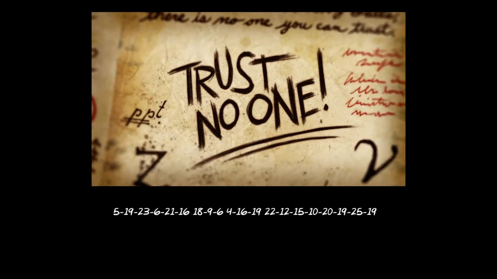

# Gravity Falls 1

Flag: `kossCTF{search_for_the_blindeye}`

Author: `Alex Hirsch` (the creator of Gravity Falls)

Description: 
> Flag Format: `kossCTF{decoded_string_in_lowercase_with_underscores}`

---

I fucked up by adding this challenge a little. I didn't check thoroughly and thought it was a simple alphabet substitution thing. However this was a combination of a1z26 -> atbash -> caesar. Eventually I increased the points when I realised.

I haven't used the atbash cipher before so lets explore that in this writeup

We were given this image. This is the end credit cipher from the season finale of season 1 of Gravity Falls, "Gideon Rises". An option besides decrypting this would be to just look for the solution to this online. The Gravity Falls wiki has all the solutions.

The first thought would be to convert the numbers to the alphabet. That gives us

"ESWFUP RIF DPS VLOJTSYS"

Now putting this in a caesar cipher decryptor doesn't given us anything. Gravity Falls also uses the Atbash cipher a lot, so we'll try that out. 

This was a screw up on my part. There was no mention of the Atbash cipher in the slides or in the hint, and the challenge was initially just for 50 points. 

The Atbash cipher is very simple. It just reverses the alphabet essentially. So 'A' becomes 'Z'. 'B' becomes 'Y' and so on. Let's reverse this alphabet with [DCode](https://dcode.fr/en)

That gives me 

"VHDUFK IRU WKH EOLQGHBH"

This looks a lot more caesar ciphery. Notice "IRU" maps to "FOR". Decoding again with [DCode](https://dcode.fr/en)

"SEARCH FOR THE BLINDEYE" Which you just needed to enter in the flag format.

---
 
Again I apologise for the issue with this challenge, and I regret the time people must have wasted on this one. My bad.
