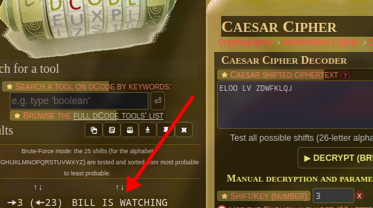

# Gravity Falls 2

Flag: `kossCTF{bill_is_watching}`

Author: `Alex Hirsch` (creator of Gravity Falls)

Description:
> Flag Format: `kossCTF{decoded_string_in_lowercase_with_underscores}`

---

We are given this image from the episode "Gideon Rises", the season one finale of Gravity Falls.

On the pipe you can see some text. "ELOO LV ZDWFKLQJ". This is a simple caesar cipher.

We can decode this with [DCode](https://dcode.fr/en).

This immediately gave us our flag. 

