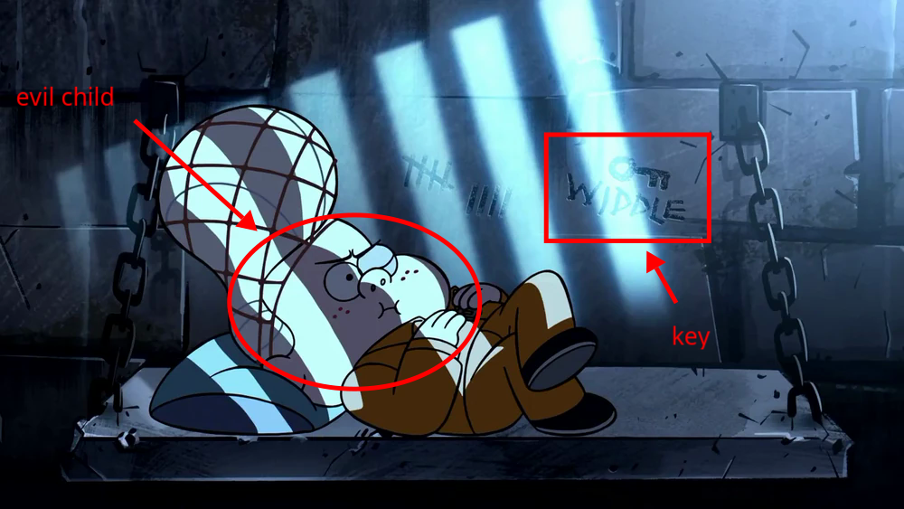
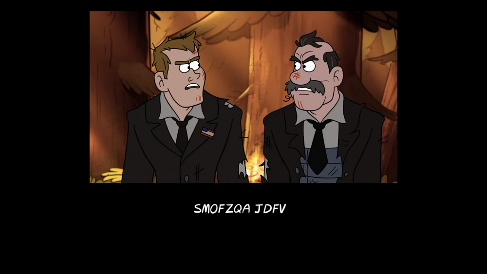
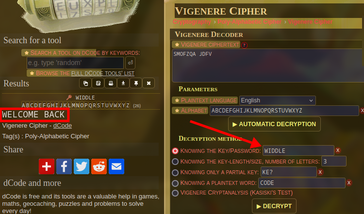

# Gravity Falls 3

Flag: `kossCTF{welcome_back}`

Author: `Alex Hirsch` (creator of gravity falls)

Description: 
> Flag Format: `kossCTF{decoded_string_in_lowercase_with_underscores}`

---

You were given two images from episode 1 of season 2 of Gravity Falls "Scary-oke"

A similar example was done in the slides of the vigenere cipher. You just needed to find the key and decode the end credit cipher.

The text reads "SMOFZQA JDFV". Let's decode this with [DCode](https://dcode.fr/en)

Now just enter this in the flag format.
