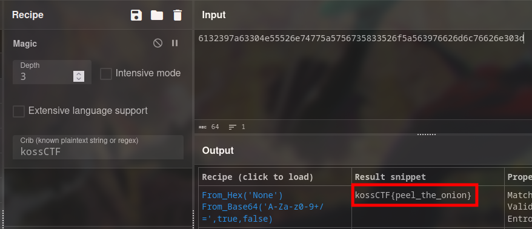

# Vegetable Market

Flag: `kossCTF{peel_the_onion}`

Author: `subzcuber`

Description:
> How many layers does the onion have?
> 
> Hint: [CyberChef](https://cyberchef.org) is a *magical* tool

---

The onion stuff was a bit of a red herring. This was a simple challenge that just encoded the plaintext to base64 then converted it to hex.

The intent was to introduce you to crypto tools that could run their own analysis. From the hint, Cyberchef has a "Magic" recipe that automatically tries stuff for you.

You can see we inputted the crib with a known plaintext, i.e.the flag format. However this was not necessary and cyberchef would have decoded it anyway

This is just to demo that the flag format it useful too

