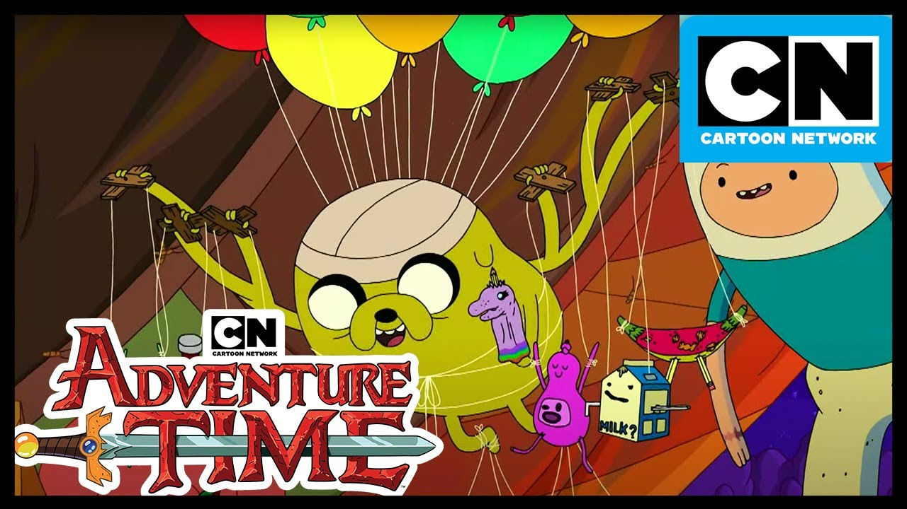

# Adventure Time

Flag: `kossCTF{come_along_with_me}`

Author: `subzcuber`

Description:
> In this episode Jake is a puppet master who uses strings to control his dolls

---

You are given the image `master-of-puppets.jpg`



From the description, and in general as well just use strings

```sh
strings master-of-puppets.jpg
```

Output: 
```
*iM~
Gv9ge\
'aE4
:fs[
.	:f
n]>s
_^T(g
<+k4f
[]x!c
kossCTF{come_along_with_me}
```
