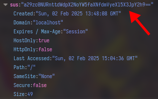

# Hokago Tea Time

Flag: `kossCTF{mugi_chan_is_veryyy_rich}`

Author: `subzcuber`

Description: 
> Can you figure out the favourite snack of our K-On girls?

---

It was a crazy experience seeing so many people play K-On songs in a large Nalanda classroom. Thank you everyone. 

From the webpage and the description you were supposed to figure out that their favourite snack is "Cookies". This is a sign to go look at the cookies with your browser tools. 

You should see this "sus" cookie 



The value it stores is 

```
a29zc0NURnttdWdpX2NoYW5faXNfdmVyeXl5X3JpY2h9==
```

The "==" is a dead giveaway that this is base64 encoded. So let's decode that 

```sh
❯ echo -n "a29zc0NURnttdWdpX2NoYW5faXNfdmVyeXl5X3JpY2h9" | base64 -d
kossCTF{mugi_chan_is_veryyy_rich}
```

> The "==" isn't really a part of the encoded string, its just an identifier that this is a base64 string
> 
> Similarily just one "=" is a base32 string, which makes "===" a base62->base32 string or vice versa. CTFs very (very) often use base64 encoding and play around with other bases too. I believe there's a base65536 somewhere too

You could also just go into the `script.js` and see the line that set the cookie. 

```js
document.cookie = "sus=a29zc0NURnttdWdpX2NoYW5faXNfdmVyeXl5X3JpY2h9==; path=/;";
```
