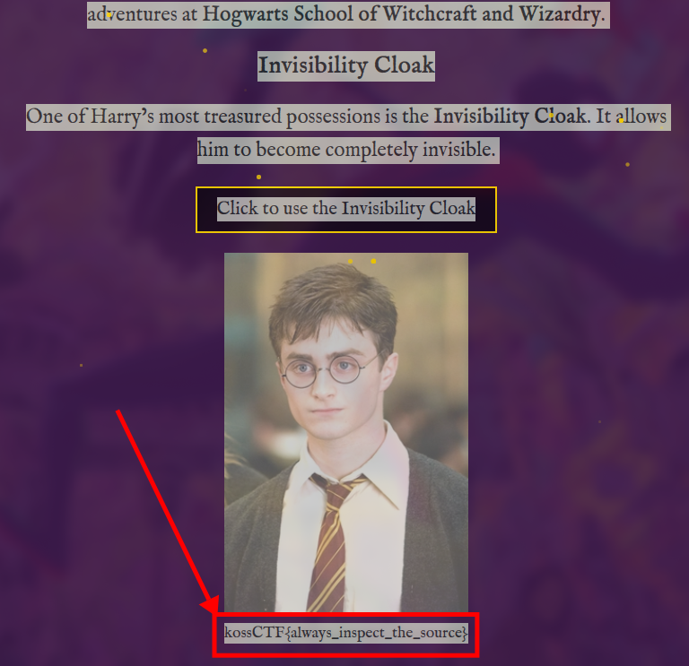

# Invisibilty Cloak

Flag: `kossCTF{always_inspect_the_source}`

Author: `subzcuber`

Description:
> Harry's Invisibility Cloak does a fantastic job hiding him from Voldemort. Is it hiding anything else?

---

This challenge simply involved using your browser tools to inspect the source. In the html you would notice a `<span>` tag with inline styling making it invisble.

```html
<span style="color: transparent;cursor: none; text-shadow: 0 0 5px rgba(0,0,0,0.09);text-decoration: line-through;">kossCTF{always_inspect_the_source}</span>
```

A simpler approach to these kind of challenges is to simply do `Control + A` (select all) on the web page. This highlights everything, including "invisible" elements.


